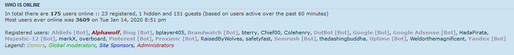

Hide Bots
=========================

phpBB extension that will not show bots to regular users and guests within the online user list in the stats section.  Admins will still be able to see the bots in the stats section.

[](https://travis-ci.com/rmcgirr83/hidebots)
## Installation

Admin View


Guest View


### 1. clone
Clone (or download and move) the repository into the folder ext/rmcgirr83/hidebots:

```
cd phpBB3
git clone https://github.com/rmcgirr83/hidebots.git ext/rmcgirr83/hidebots/
```

### 2. activate
Go to admin panel -> tab customise -> Manage extensions -> enable Hide Bots


### 3. Update instructions:
1. Go to you phpBB-Board > Admin Control Panel > Customise > Manage extensions > Hide Bots: disable
2. Delete all files of the extension from ext/rmcgirr83/hidebots
3. Upload all the new files to the same locations
4. Go to you phpBB-Board > Admin Control Panel > Customise > Manage extensions > Hide Bots: enable